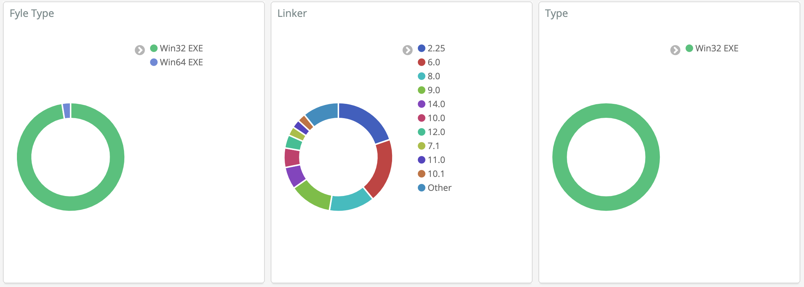
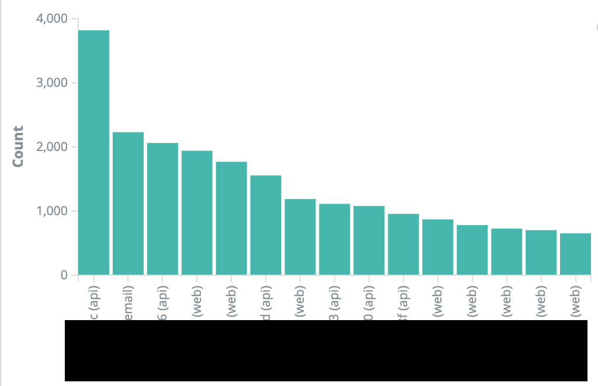
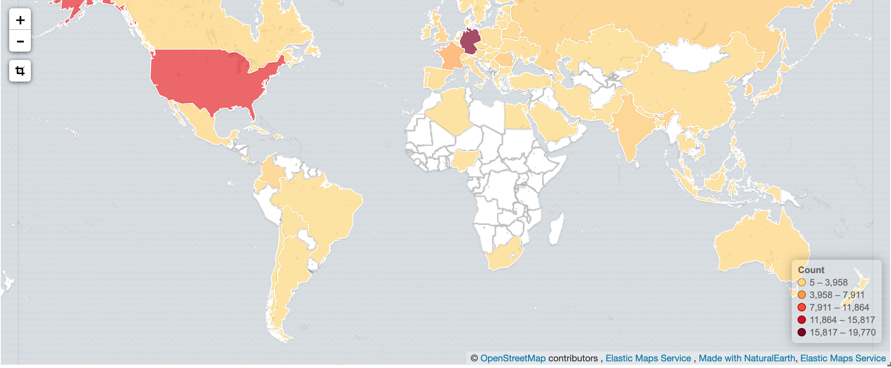

# Lurking threat actors and targets with VT

# Intro

Tracking malware actors and targets is not an easy task, so if you have a VirusTotal account with private API capabilities, I will provide you some tips and tricks to set up your control panel. We will use the ELK stack, some Python and lot of Yara rules.

# Get your hands dirty with Nutella

     
First of all, you will need to write some Yara rules to feed our system, I will show you some examples:

~~~~ 
rule new_suspicious
{
  condition:
    
    new_file and file_type contains "pe" and positives < 8 and positives > 3 

}
~~~~ 

This example will track:

* New submissions (so we will avoid repeated samples, an ensure freshness)
* PE files
* With detections between 4 and 7 (so it will not be very detected but enough to avoid lot of FP)

Actually, we can optimize much more this rule in order to focus on specifics threats.

~~~~ 
rule mail_es
{
  strings:
    $a = "To: " nocase ascii wide
    $b = ".es" nocase ascii wide
    $c = "Subject: " nocase ascii wide
  condition:
    new_file and file_type contains "email" and @a < @b and @b < @c
}
~~~~ 

This second example is pretty simple, you will track:

* New submissions 
* Emails
* Contains a .es domain between "To" and "Subject"

~~~~ 
import requests

url = "https://www.virustotal.com/api/v3/intelligence/hunting_notifications"

params = {'apikey': '<apikey>'}

response = requests.request("GET", url, params=params)
~~~~ 

We will receive the details related to the samples; we will need to use the cursor parameter to iterate all the notifications. 

~~~~ 
      "attributes": {
        "body": "",
        "date": 1553732253,
        "subject": "mail_es",
        "tags": [
          "feed",
          "mail_es",
          "1245d5d1454ab86f35b1019ee9cd6b6d2aa028d1400e3353305b1a1dc638ad25"
        ]
      }
~~~~ 

We get the hash from the tags in order to perform a second query to VT, for this it is important your API key allows you to fetch all the fields are interesting for us.

* source_id
* first_seen
* first_name

What is source id? If you are familiar with VT you may realize that you in each report will find a 'Submissions' tab. This tab shows information about when and from where was uploaded the sample.

| Date                | File name | Source         | Country |
|---------------------|-----------|----------------|---------|
| 2019-03-28 06:28:51 | 6700138   | a1a85c39 (api) | US      |
| 2019-03-29,10:35:10 | malware   | fa8be158 (web) | UK      |

In this table we can see the "6700138" file was uploaded via API (it maybe also possible email, web or community) on 2019-03-28 by a user located in US (or using an IP Address from US).

But what is that source? Okay, this is getting interesting. VT doesn't want to save the IP address of a submitter, but at the same type this attribution is very interesting for researchers, so VT assign an id to each user they can recognize as the same submitter and they call it source. 

If we have the right permissions, we will be able to query all this data to VT via API, that means we will collect not only the files matching our Yara rules, but also some metadata related to the origin/target of the malware samples.

Let’s talk about origin. Advanced actors may never upload the samples directly to VT, because they may expose their samples too much and the AV engines will be able to detect them before they spreads the final binary. However, I found some actors are uploading malware samples to VT and tweaking their samples to decrease detections, in some cases until they become almost undetected. 

If we are able to collect several source_ids, and store into our database, we will be able to:

* Identify the location of an actor
* See evolution of a malware sample: we can download the sample and analyze the functionality and evasion capabilities
* Associate different samples to the same actor
* Analyze the periods of activity on a calendar
* Identify paths or even usernames based on first submission file name

What about the target? The second rule checks for new emails uploaded to VT received by users under a .es domain, so that might allow us to:

* Identify the organization under the source_id based on the domain of the email address
* Identify malware targeting the organization, looking for PE files with the same source_id 
* Monitor the techniques used against specific organization or a sector.

However, the source_id may change within the time frame we are researching. With email-based yara rules is not an issue, because each email has the destination address, but in the case of binaries it may be complicated to track the authors along the time. Fortunately, we can reuse the information we collected from the actor, and in some cases, we will be able to extract characteristics like imphash, entrypoint address, linker version, ... that will help us to track new source_ids related to the actor.

I have been using Yara for tracking some interesting submissions since September 2018, but I set up my new environment by December 2018, so today I have collected close to 300k submissions with very interesting metadata.

Most of the submissions I captured are PE files, x86 using different kind of linkers, but mostly Visual Studio.

Let’s review a few simple examples of sample based on my Yara rules.

After playing and pivoting with my data I found a source_id in US submitting the following files between Feb 19 and Feb 21:

| Time                             | MD5                              | First name                    |
|----------------------------------|----------------------------------|-------------------------------|
| February 21st 2019, 00:01:46.000 | 345e2e55f48b64d697e3dfee8b9a2fe4 | mypc2.exe                     |
| February 20th 2019, 23:37:58.000 | beeaecf669e7f8e7e5a7094c0fbe1da3 | mypc.exe                      |
| February 20th 2019, 23:15:32.000 | 5b8dfc5e482d6816cdd6a5d024b92fad | malware_dd_imp2_pad_04res.exe |
| February 20th 2019, 21:31:37.000 | a7a5046c5c36f4648e8b432009d8717a | malware_dd_imp2_pad_06        |
| February 20th 2019, 21:21:41.000 | 5d8f025d942dbe92ae905a65fac75125 | malware_dd_imp2_04            |
| February 20th 2019, 06:35:14.000 | 2c6187ca6d158fc77eb72db29c8558dc | malware_dd.exe                |
| February 19th 2019, 23:01:01.000 | b390cb55e962296d128572a1c3acbc91 | osk_dd2.exe                   |
| February 19th 2019, 22:39:57.000 | a4aba6a64d09c7002147c4489cd08852 | osk_pad_fi_2.exe              |
| February 19th 2019, 22:09:59.000 | 00700a525d1dcdffd7aac5cbf82467cc | osk_pad_fi.exe                |

It is obvious this is not a user or an organization trying to get results for a suspicious file, it may be an actor or a researcher trying to avoid AV detections.

Here we have another example from the Philippines, this one is having fun.. LOL!

| Time                             | EntryPoint | MD5                              | First name                    |
|----------------------------------|------------|----------------------------------|-------------------------------|
| February 20th 2019, 10:44:14.000 | 0x8b56     | b337842ac26256c9c922c8446392833e | InsaneHackerGame.exe          |
| February 16th 2019, 14:49:13.000 | 0x8b56     | 08c84376698550e736308e9b8b21e0e1 | ServerSecurityActiveLogin.exe |
| February 15th 2019, 12:18:57.000 | 0x8b56     | a0e2d1a90871c4656adf2ee79a5aa0e6 | lol.exe                       |
| February 15th 2019, 03:52:22.000 | 0x8b56     | e99d2f626d1494a88d5f74535c38c6c9 | ServerDataUltraSecurity.exe   |

Let’s review a source_id from Spain submitting files, in the last version we can see the EntryPoint changes respect to the previous versions. In one of the submissions we can appreciate the username “director1”:

| Time                             | EntryPoint | MD5                              | First name                          |
|----------------------------------|------------|----------------------------------|-------------------------------------|
| February 4th 2019, 13:44:17.000  | 0x4a0c0    | ffe83c8f462d6d3a752689ff19b1a873 | rentacert.exe                       |
| January 31st 2019, 22:52:13.000  | 0x1596f    | 63f0dbf5b590dd95056da010d638214f | C:\Users\director1\rentacert(4).exe |
| January 29th 2019, 19:00:10.000  | 0x1596f    | a53d1c26ce6529829580b0e75097ba07 | avanzada.exe                        |
| January 21st 2019, 20:17:05.000  | 0x1596f    | ff4da2037b978b50408d36eab57c608c | avanzada.exe                        |
| December 18th 2018, 12:07:52.000 | 0x1596f    | 8344bdee57110fe259729fe3a49036e9 | avanzada.exe                        |
| December 17th 2018, 00:13:47.000 | 0x1596f    | 0415275894d2141fab0a3aaebd6c300f | avant.exe                           |

Going back to the email-based Yara rules, with my rules I received files from different sources: API, email and web, mostly related to exploits and most of them submitted by users from Germany.

## Conclusion

VT is a fantastic tool for tracking targeted malware from both perspectives, actor and a target.

## Resources

* VirusTotal: <https://virustotal.com/>
* Yara: <https://virustotal.github.io/yara/>
* ELK: <https://www.elastic.co/elk-stack>

